# Trees

## Table of contents

- [Binary Tree](#binary-tree)
  - [Root Node](#root-node)
  - [Leaf Nodes](#leaf-nodes)
  - [Children](#children)
  - [Height](#height)
  - [Depth](#depth)
  - [Ancestor](#ancestor)
  - [Descendent](#descendent)
- [Binary Search Trees](#binary-search-trees)
  - [Binary Trees vs Binary Search Trees](#binary-trees-vs-binary-search-trees)
  - [Insertion and Removal from a Binary Search Tree](#insertion-and-removal-from-a-binary-search-tree)
    - [Insertion](#insertion)
    - [Removal](#removal)
      - [Case 1 - The target node has one child or no children](#case-1---the-target-node-has-one-child-or-no-children)
      - [Case 2 - The target node has two children](#case-2---the-target-node-has-two-children)
  - [Depth-First Search](#depth-first-search)
    - [Inorder Traversal](#inorder-traversal)
    - [Preorder Traversal](#preorder-traversal)
    - [Postorder Traversal](#postorder-traversal)
- [Other topics](#other-topics)

## Binary Tree
Similar to linked lists, binary trees are another data structure that involve nodes and pointers.

With linked lists, we connected nodes in a straight line with next and prev pointers. Nodes in a binary tree also have at most two pointers, but we call them the left child and the right child pointers. The first node in a binary tree is referred to as the root node. We draw the pointers down instead of a straight line.

The value of a node can be any data type.

If a node does not have any children, it is classified as a leaf node. If a node has even a single child, either left or right, it would be classified as a non-leaf node.

Unlike linked lists, binary tree node pointers can only point in one direction. As such, cycles are not allowed in binary trees. Mathematically speaking, a binary tree is a connected, undirected graph with no cycles. This means that a leaf node is always guaranteed to exist. 

### Root Node
Root node is the highest node in the tree and has no parent node. All of the nodes in the tree can be reached by the root node.

### Leaf Nodes
Leaf nodes are nodes with no children. The nodes at the last level of the tree are guaranteed to be leaf nodes but they can also be found on other levels.

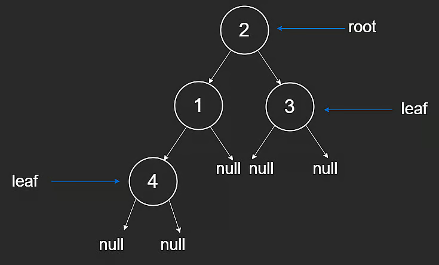

### Children
The children of a node are its left child and right child.

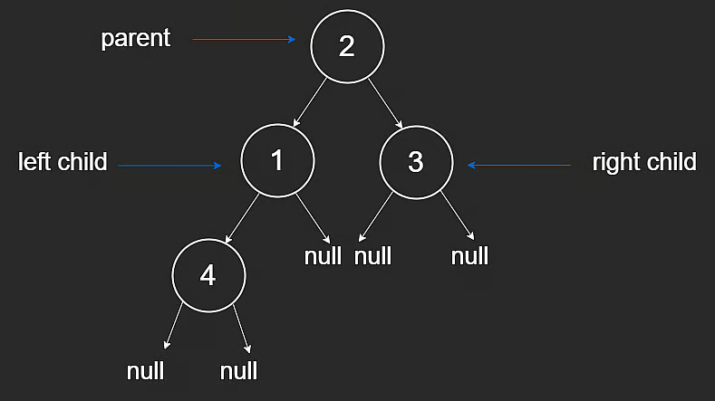

### Height
The height of a binary tree is measured from the root node all to way to the lowest leaf node, just like the height of anything in real life. The height of a single node tree is just 11, if the node itself is counted, or 00 if not.

### Depth
Depth of a binary tree node is measured from itself all the way up to the root. As observed in the visual below, the depth at the root node is 11, with it increasing as we go down. Measure depth at a given node by looking at how many nodes are above it, including the node itself.

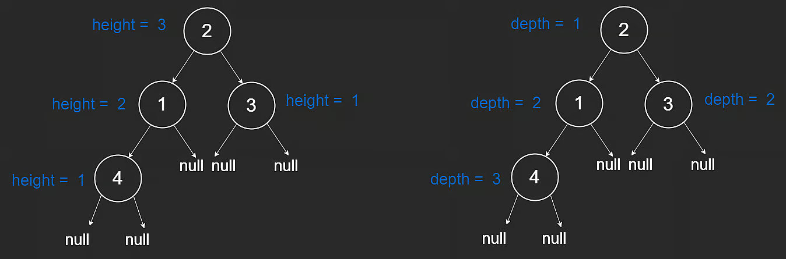

### Ancestor
A node connected to all of the nodes below it is considered an ancestor to those nodes. For example, the root node is an ancestor to all of the nodes in the tree.

### Descendent
The descendent of a node is either child of the node or child of some other descendent of the node.

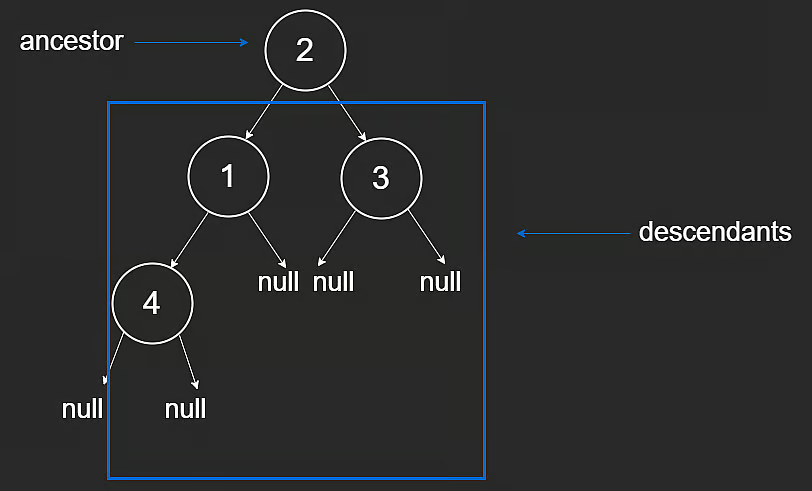

## Binary Search Trees
Why use a binary search tree instead of a sorted array that binary search can already be applied to? Because inserting and deleting values is much simpler, and we avoid shifting elements around.

### Binary Trees vs Binary Search Trees
Binary Search Trees (BST) are a variation of binary trees with the addition of a sorted property. The property is that every node in the left subtree is smaller than the root and every node in the right subtree is greater than the root.
This is a recursive property, meaning that it applies to every node in the tree. This property is analogous to having a sorted array.
Since trees are a recursive data structure, the simplest way to traverse them is using recursion.

### Insertion and Removal from a Binary Search Tree
#### Insertion
If we wish to insert a new node into the BST, we first have to traverse the BST to find the right position, and then insert this node. We must make sure we maintain the sorted property of the BST, just like we would with a sorted array.

To summarize the code above:

1. If the current node is null, we return a new node with the value val.
2. If the value is greater than the current node, we recursively call the function with the right child of the current node.
3. If the value is less than the current node, we recursively call the function with the left child of the current node.
4. We return the current node after the recursive call.

Notice that we return a new node if the current node is null. This is how we add a new node to the tree. Even in the recursive case, we return the current node after the recursive call.

Notice that the return values from the recursive calls are assigned to either the left or right child of the current node. This is how we maintain the tree structure.

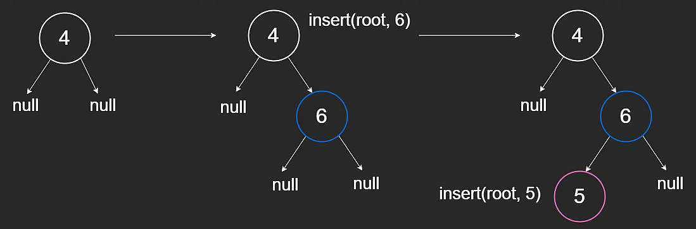

The visual above demonstrates how insertion is done. 66 is greater than the root node, so it ends up in the right sub-tree. 55 is greater than the root node but smaller than 66 so it ends up in the left subtree of the tree rooted at 66.
#### Removal
Before removing a node from a BST, we need to consider two cases:

1. The target node has 0 or 1 child
2. The target node has 2 children

##### Case 1 - The target node has one child or no children
If we wish to delete node 2, which has no children, the left_child pointer of 3 now points to null.

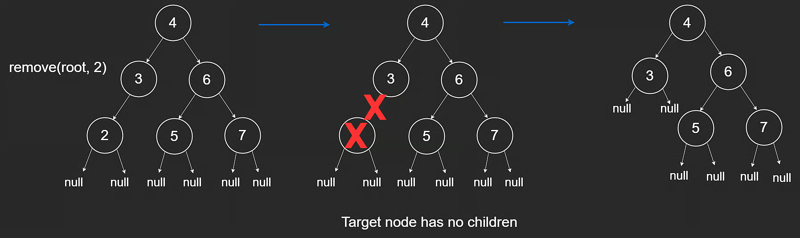

If we wish to delete node 3, which has one child, the left_child pointer of the root node will point to 2 instead of 3. 

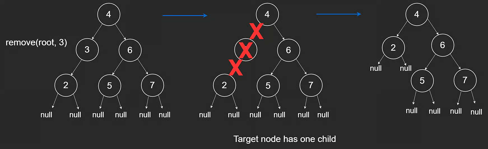

##### Case 2 - The target node has two children
If we wanted to delete a node with two children, say, 6, we replace the node with its in-order successor.

The in-order successor is the left-most node in the right subtree of the target node. Another way of looking at it is that it is the smallest node among all the nodes that are greater than the target node. This will ensure that the resulting tree is still a valid binary search tree.

The visual below shows process of deletion of nodes with two children.

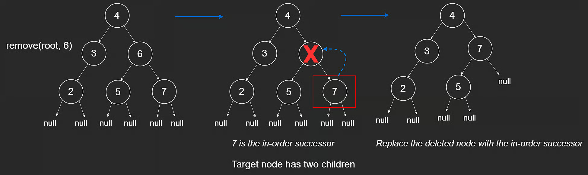

### Depth-First Search
Depth First Search (DFS) is one of the most common algorithms in coding interviews. It is commonly used to traverse trees and graphs.

The idea is we pick a direction, say left, and keep following pointers as far down left as we can go until we reach null. Once we reach null, we backtrack to the parent node and then go right. We keep doing this until we have visited every node in the tree. This is the essence of depth-first search.

As the name implies, we go as deep as possible before we backtrack.

There are three ways to traverse a tree using depth-first search:

1. Inorder
2. Preorder
3. Postorder

#### Inorder Traversal
An inorder traversal will recursively visit all the nodes in the left subtree, then visit the parent node and finally visit all the nodes in the right subtree. In this case, "visit" could mean anything from printing the node to performing some operation on it.

The order in which these nodes will be visited is [2,3,4,5,6,7], which is sorted. It is important to note that an inorder traversal will only print the nodes in a sorted order if the tree is a binary search tree.

>The reason the nodes will print in a sorted order is because of the BST property. Since we know all values to the left of a node are smaller, this means we won't hit our base case until we reach the left-most node which is also the smallest node. After visiting this, we will traverse up, visit the parent and then visit the right-subtree. The visual below shows this process.

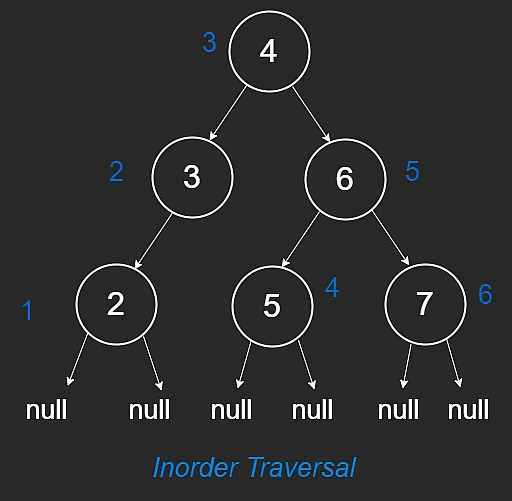

#### Preorder Traversal
Alternatively, preorder traversal will visit the parent node first, then visit the left subtree and finally visit the right subtree.
The nodes are visited in the following order [4,3,2,6,5,7]

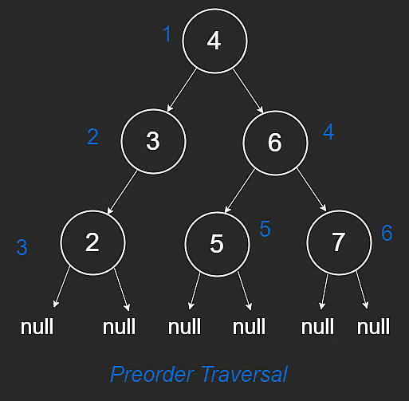

#### Postorder Traversal
A postorder traversal will visit the left subtree, then the right subtree and finally the parent node last.
The order in which these nodes will be visited is: [2,3,5,7,6,4]

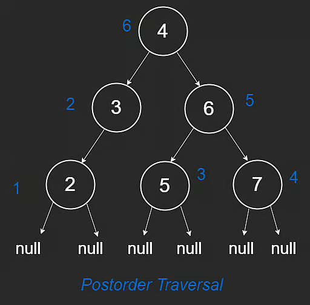

## Other topics

- [Back to the main index](../README.md)
- [Arrays & Stacks](../arrays-stacks/README.md)
- [Binary Search](../binary-search/README.md)
- [Linked Lists](../linked-lists/README.md)
- [Recursion](../recursion/README.md)
- [Sorting](../sorting/README.md)
